> **Artificial** **Intelligence** **in** **Cyber** **Defense:** **A**
> **Review** **of** **Current** **Applications** **and**
> **Technologies**
>
> Ahsen Beyza Özkul
>
> [<u>ahsenbeyza@securedebug.com</u>](mailto:%20%20ahsenbeyza@securedebug.com)

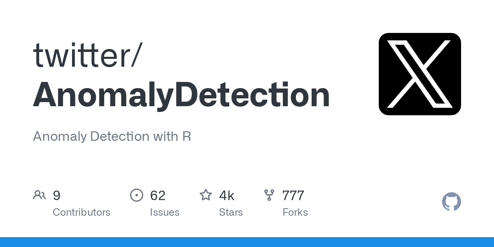

> **1)** **AI** **for** **Threat** **Detection** **and** **Incident**
> **Response**
>
> • **Project:** **Twitter's** **Anomaly** **Detection** **Tool**
> *Example:* *Twitter* *created* *a* *tool* *to* *spot* *unusual*
> *patterns* *in* *data* *like* *network* *traffic* *and* *user*
> *activities.* *This* *tool* *monitors* *things* *in* *real-time* *and*
> *uses* *machine* *learning* *to* *quickly* *detect* *and* *alert* *on*
> *any* *strange* *behavior.*
>
> 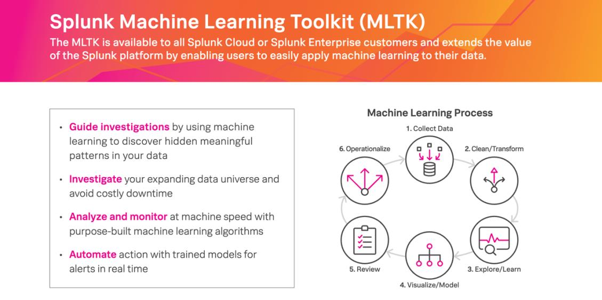 style="width:5.88403in;height:2.94167in" />• **Project:** **Splunk's**
> **Machine** **Learning** **Toolkit** *Example:* *Splunk* *offers* *a*
> *set* *of* *tools* *that* *use* *machine* *learning* *to* *detect*
> *anomalies* *in* *system* *logs* *and* *operations.* *It's* *commonly*
> *used* *in* *IT* *to* *identify* *unusual* *activities* *and* *send*
> *alerts* *before* *they* *turn* *into* *bigger* *issues.*

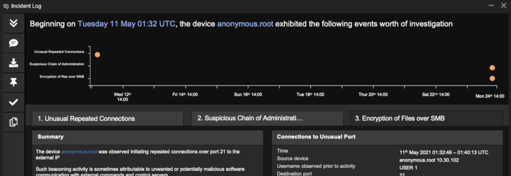

> • **Project:** **Darktrace** **AI** **for** **Incident** **Response**
> *Example:* *Darktrace* *uses* *AI* *to* *automatically* *respond* *to*
> *cyber* *threats.* *When* *an* *attack* *happens,* *Darktrace* *can*
> *isolate* *the* *affected* *parts* *of* *your* *system* *to* *prevent*
> *the* *problem* *from* *spreading,* *allowing* *your* *security*
> *team* *to* *focus* *on* *fixing* *the* *issue* *without* *worrying*
> *about* *it* *getting* *worse.*
>
> • **Project:** **Microsoft** **Security** **Copilot** **for**
> **Incident** **Response** *Example:* *Microsoft* *Security* *Copilot*
> *helps* *automate* *the* *process* *of* *dealing* *with*
> *cyberattacks.* *It* *can* *quickly* *respond* *to* *incidents* *by*
> *isolating* *the* *problem,* *providing* *the* *necessary*
> *information* *to* *fix* *it,* *and* *restoring* *systems* *to*
> *normal.* *This* *saves* *time* *and* *effort* *for* *security*
> *teams.*
>
> 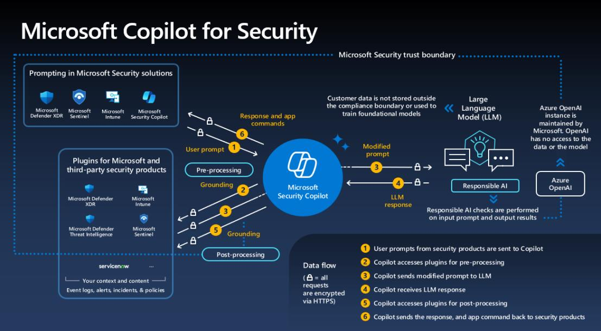 style="width:5.76805in;height:3.18056in" />• **Project:**
> **Microsoft** **Security** **Copilot** *Example:* *Microsoft*
> *Security* *Copilot* *is* *a* *tool* *that* *uses* *AI* *to* *help*
> *keep* *your* *network* *safe.* *It* *works* *by* *constantly*
> *scanning* *for* *any* *unusual* *activities* *or* *potential*
> *threats* *and* *can* *react* *immediately* *to* *stop* *them.* *This*
> *makes* *it* *easier* *for* *companies* *to* *protect* *their* *data*
> *without* *relying* *solely* *on* *human* *monitoring.*

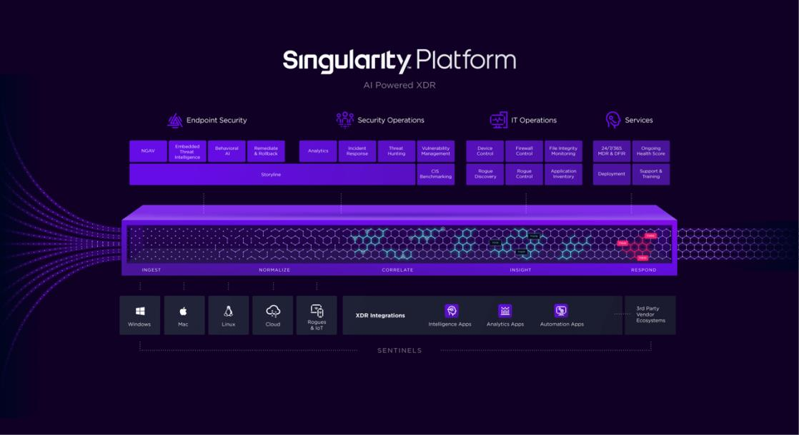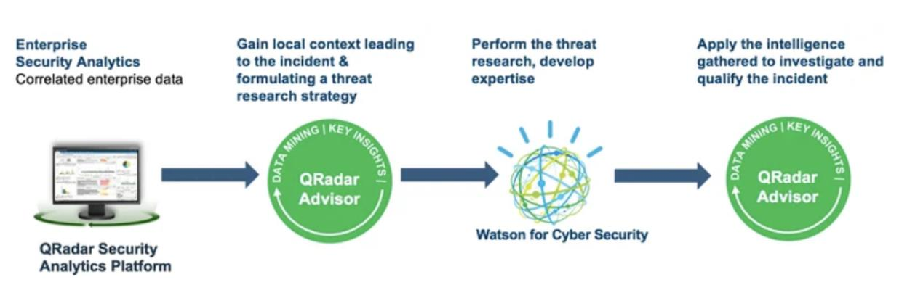

> • **Project:** **SentinelOne’s** **Singularity** **Platform**
> *Example:* *SentinelOne’s* *Singularity* *platform* *uses* *AI* *to*
> *help* *security* *teams* *hunt* *for* *threats* *across* *the*
> *entire* *network.* *It* *pulls* *together* *data* *from* *all*
> *parts* *of* *your* *system,* *giving* *a* *clear* *view* *so* *that*
> *threats* *can* *be* *found* *and* *dealt* *with* *quickly.*
>
> • **Project:** **IBM** **QRadar** **and** **Watson** **for** **Cyber**
> **Security** *Example:* *IBM’s* *QRadar* *security* *system* *uses*
> *Watson’s* *AI* *to* *automatically* *analyze* *security* *data.*
> *This* *helps* *security* *teams* *quickly* *spot* *and* *respond*
> *to* *potential* *threats,* *saving* *time* *and* *effort.*
>
> • **Project:** **AWS** **GuardDuty** *Example:* *AWS* *GuardDuty*
> *uses* *AI* *to* *monitor* *and* *analyze* *data* *from* *AWS*
> *services* *to* *detect* *unusual* *activities.* *It* *identifies*
> *potential* *security* *breaches,* *such* *as* *abnormal* *API*
> *calls* *or* *unauthorized* *access* *attempts,* *enhancing* *threat*
> *detection.*

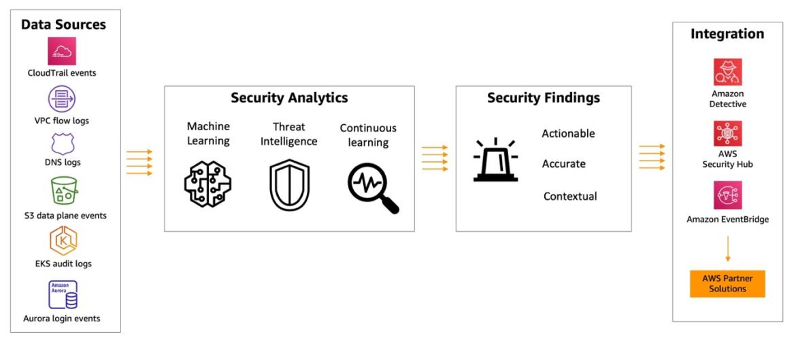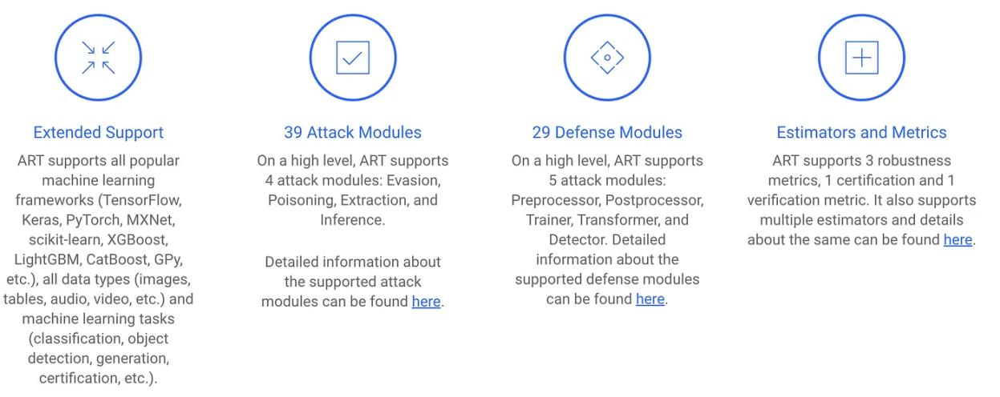

> **2)** **AI** **for** **Vulnerability** **Management** **and**
> **Security** **Enhancement**
>
> • **Project:** **IBM's** **Adversarial** **Robustness** **Toolbox**
> **(ART)** *Example:* *IBM’s* *ART* *is* *a* *toolkit* *designed* *to*
> *protect* *AI* *systems* *from* *attacks.* *It* *helps* *make* *AI*
> *models* *more* *secure* *by* *defending* *against* *threats* *like*
> *data* *poisoning* *or* *hacking* *attempts* *that* *target* *AI*
> *weaknesses.*
>
> • **Project:** **TensorFlow** **Privacy** *Example:* *TensorFlow*
> *Privacy* *is* *an* *extension* *of* *the* *TensorFlow* *platform*
> *that* *ensures* *AI* *models* *are* *trained* *with* *privacy*
> *protections.* *This* *makes* *the* *AI* *systems* *less* *vulnerable*
> *to* *being* *exploited* *or* *manipulated* *by* *attackers.*
>
> • **Project:** **OWASP** **ZAP** **with** **Machine** **Learning**
> *Example:* *OWASP* *ZAP* *is* *a* *tool* *that* *tests* *web*
> *applications* *for* *security* *flaws.* *By* *adding* *machine*
> *learning,* *it* *can* *automate* *the* *process* *and* *become*
> *more* *effective* *at* *finding* *issues* *like* *SQL* *injections*
> *or* *cross-site* *scripting* *(XSS).*

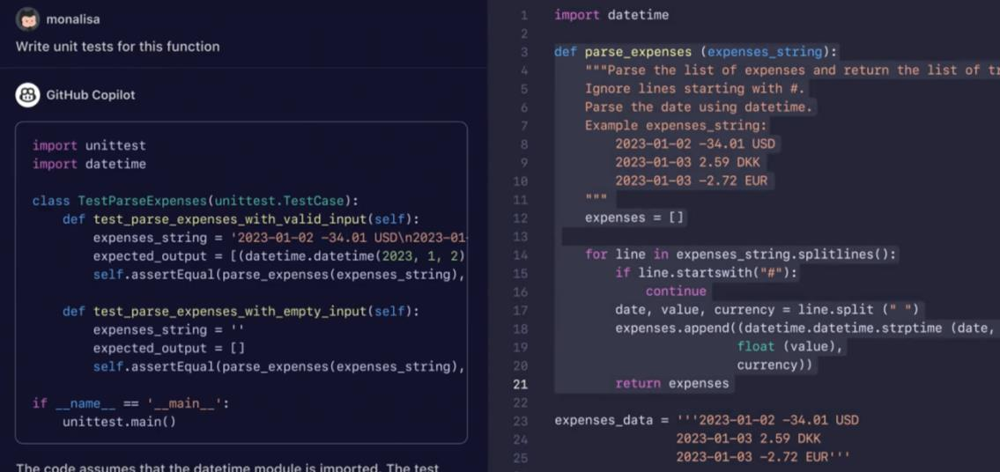

> • **Project:** **HackerOne** **with** **AI-Enhanced** **Scanning**
> *Example:* *HackerOne* *is* *a* *platform* *where* *security*
> *researchers* *find* *bugs* *in* *software.* *It* *uses* *AI* *to*
> *help* *automate* *the* *search* *for* *vulnerabilities,* *making*
> *it* *faster* *and* *easier* *to* *discover* *weaknesses* *in*
> *applications.*
>
> • **Project:** **GitHub** **Copilot** **and** **CodeQL** *Example:*
> *GitHub* *Copilot* *is* *an* *AI* *tool* *that* *helps* *developers*
> *write* *code.* *When* *used* *with* *CodeQL,* *it* *also* *scans*
> *for* *security* *issues* *in* *the* *code* *as* *it's* *being*
> *written,* *helping* *catch* *problems* *early* *before* *they*
> *become* *serious.*
>
> • **Project:** **SonarQube** **with** **AI** **Plugins** *Example:*
> *SonarQube* *is* *a* *tool* *for* *checking* *the* *quality* *and*
> *security* *of* *code.* *With* *AI* *plugins,* *it* *gets* *even*
> *better* *at* *finding* *vulnerabilities* *and* *reduces* *the*
> *number* *of* *false* *alarms,* *making* *it* *easier* *for*
> *developers* *to* *fix* *real* *issues.*
>
> • **Project:** **IBM’s** **Guardium** **for** **Patch** **Management**
> *Example:* *IBM’s* *Guardium* *uses* *AI* *to* *keep* *your* *data*
> *safe* *by* *finding* *and* *fixing* *vulnerabilities* *in* *both*
> *on-premises* *and* *cloud* *environments.* *It* *adapts* *to* *new*
> *threats* *and* *helps* *ensure* *that* *your* *data* *is* *protected*
> *by* *applying* *necessary* *patches* *on* *time.*
>
> • **Project:** **Tenable’s** **Exposure** **AI** *Example:*
> *Tenable’s* *Exposure* *AI* *helps* *identify* *and* *fix* *weak*
> *spots* *in* *your* *system* *before* *hackers* *can* *exploit*
> *them.* *It* *uses* *AI* *to* *scan* *for* *vulnerabilities,*
> *prioritize* *which* *ones* *are* *most* *critical,* *and* *ensure*
> *they* *are* *patched* *quickly,* *making* *your* *system* *more*
> *secure.*

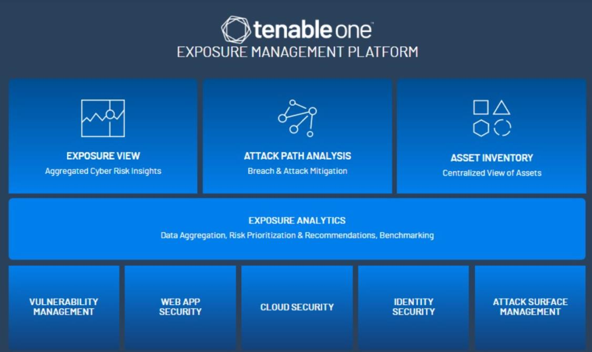

> • **Project:** **Zscaler** **Data** **Protection** *Example:*
> *Zscaler* *Data* *Protection* *uses* *AI* *to* *safeguard* *sensitive*
> *information* *by* *scanning* *documents,* *emails,* *and* *images.*
> *It* *classifies* *data,* *detects* *unauthorized* *access,* *and*
> *prevents* *data* *breaches,* *making* *it* *easier* *to* *manage*
> *and* *protect* *sensitive* *information.*
>
> **3)** **AI** **for** **Identity** **and** **Access** **Management**
>
> 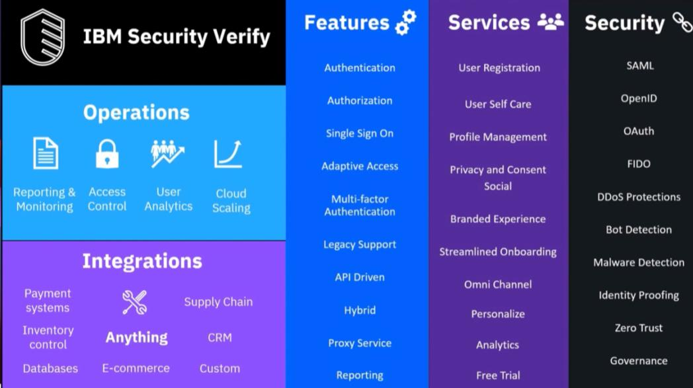 style="width:5.46319in;height:3.05833in" />• **Project:** **IBM**
> **Verify** *Example:* *IBM* *Verify* *uses* *AI* *to* *enhance*
> *identity* *and* *access* *management* *by* *analyzing* *user*
> *behavior* *and* *adjusting* *authentication* *requirements.* *It*
> *can* *detect* *anomalies* *and* *automatically* *enforce*
> *multi-factor* *authentication,* *improving* *security* *while*
> *simplifying* *user* *access* *management.*
>
> **References**
>
> • IBM. (n.d.). *Threat* *detection* *and* *response*. Retrieved
> September 2, 2024, from
> [<u>https://www.ibm.com/services/threat-detection-response</u>](https://www.ibm.com/services/threat-detection-response)
>
> • IBM. (n.d.). *Guardium*. Retrieved September 2, 2024, from
> [<u>https://www.ibm.com/guardium</u>](https://www.ibm.com/guardium)
>
> • IBM. (n.d.). *Watsonx* *governance*. Retrieved September 2, 2024,
> from
> [<u>https://www.ibm.com/products/watsonx-governance</u>](https://www.ibm.com/products/watsonx-governance)
>
> • Watkins, O. (2024,April 19). *4* *use* *cases* *of* *AI* *in*
> *cyber* *security*. Red Hat. Retrieved September 2, 2024, from
> [<u>https://www.redhat.com/en/blog/4-use-cases-ai-cyber-security</u>](https://www.redhat.com/en/blog/4-use-cases-ai-cyber-security)
>
> • Goss,A. (2024, May 13). *Examples* *of* *AI* *in* *cyber*
> *security*. Station X. Retrieved September 2, 2024, from
> [<u>https://www.stationx.net/examples-of-ai-in-cyber-security/</u>](https://www.stationx.net/examples-of-ai-in-cyber-security/)
>
> • Shutenko, V. (2024,August 8). *AI* *in* *cybersecurity*. TechMagic.
> Retrieved September 2, 2024, from
> [<u>https://www.techmagic.co/blog/ai-in-cybersecurity/</u>](https://www.techmagic.co/blog/ai-in-cybersecurity/)
>
> • (n.d.). *Artificial* *intelligence* *in* *cyber* *security*
> *projects*. Network Simulation Tools. Retrieved September 2, 2024,
> from
> [<u>https://networksimulationtools.com/artificial-intelligence-in-cyber-security-projects/</u>](https://networksimulationtools.com/artificial-intelligence-in-cyber-security-projects/)
>
> • Daivi. (2024, March 19). *Cybersecurity* *machine* *learning*
> *projects*. ProjectPro. Retrieved September 2, 2024, from
> [<u>https://www.projectpro.io/article/cybersecurity-machine-learning-projects/631</u>](https://www.projectpro.io/article/cybersecurity-machine-learning-projects/631)
>
> • Caniszczyk. (n.d.). *AnomalyDetection*. GitHub. Retrieved September
> 2, 2024, from
> [<u>https://github.com/twitter/AnomalyDetection</u>](https://github.com/twitter/AnomalyDetection)
>
> • Fier, J., & Kenyon Grant, S. (n.d.). *Splunk* *machine* *learning*
> *toolkit*. Splunk. Retrieved September 2, 2024, from
> [<u>https://www.splunk.com/en_us/resources/splunk-machine-learning-toolkit.html</u>](https://www.splunk.com/en_us/resources/splunk-machine-learning-toolkit.html)
>
> • Darktrace. (2022,April 12). *How* *Darktrace's* *Cyber* *AI*
> *Analyst* *accelerates* *reporting* *incidents* *to* *the* *US*
> *federal* *government*. Retrieved September 2, 2024, from
> [<u>https://darktrace.com/blog/how-darktraces-cyber-ai-analyst-accelerates-reporting-incidents-to-the-us-federal-government</u>](https://darktrace.com/blog/how-darktraces-cyber-ai-analyst-accelerates-reporting-incidents-to-the-us-federal-government)
>
> • Microsoft. (2024, July 18). *Microsoft* *security* *copilot*.
> Retrieved September 2, 2024, from
> [<u>https://learn.microsoft.com/en-us/copilot/security/microsoft-security-copilot</u>](https://learn.microsoft.com/en-us/copilot/security/microsoft-security-copilot)
>
> • (n.d.). *Singularity* *platform*. Kidan. Retrieved September 2,
> 2024, from
> [<u>https://kidan.co/partners/singularity-platform/</u>](https://kidan.co/partners/singularity-platform/)
>
> • (n.d.). *Stages* *involved* *in* *the* *working* *of* *IBM’s*
> *QRadar* *advisor* *with* *Watson*. ResearchGate. Retrieved September
> 2, 2024, from
> [<u>https://www.researchgate.net/figure/Stages-involved-in-the-working-of-IBMs-QRadar-advisor-with-Watson-64_fig3_373712758</u>](https://www.researchgate.net/figure/Stages-involved-in-the-working-of-IBMs-QRadar-advisor-with-Watson-64_fig3_373712758)
>
> • Amazon Web Services. (n.d.). *Amazon* *GuardDuty* *now* *supports*
> *Amazon* *EKS* *runtime* *monitoring*. Retrieved September 2, 2024,
> from
> [<u>https://aws.amazon.com/tr/blogs/aws/amazon-guardduty-now-supports-amazon-eks-runtime-monitoring/</u>](https://aws.amazon.com/tr/blogs/aws/amazon-guardduty-now-supports-amazon-eks-runtime-monitoring/)
>
> • Hajra,A. (2023, May 4). *IBM* *ART* *adversarial* *robustness*
> *check* *for* *a* *movie* *recommendation* *system*. Medium. Retrieved
> September 2, 2024, from
>
> [<u>https://medium.com/@asmitahajra/ibm-art-adversarial-robustness-check-for-a-movie-recommendation-system-649ba46e9e8a</u>](https://medium.com/@asmitahajra/ibm-art-adversarial-robustness-check-for-a-movie-recommendation-system-649ba46e9e8a)
>
> • (n.d.). *Copilot*. GitHub. Retrieved September 2, 2024, from
> [<u>https://github.com/features/copilot</u>](https://github.com/features/copilot)
>
> • (n.d.). *Exposure* *management:* *What* *is* *Tenable* *One?*
> E-SPIN. Retrieved September 2, 2024, from
> [<u>https://www.e-spincorp.com/exposure-management-what-is-tenable-one/</u>](https://www.e-spincorp.com/exposure-management-what-is-tenable-one/)
>
> • (n.d.). *IBM* *Verify* *reviews*. TrustRadius. Retrieved September
> 2, 2024, from
> [<u>https://www.trustradius.com/products/ibm-verify/reviews?qs=pros-and-cons#comparisons</u>](https://www.trustradius.com/products/ibm-verify/reviews?qs=pros-and-cons#comparisons)
